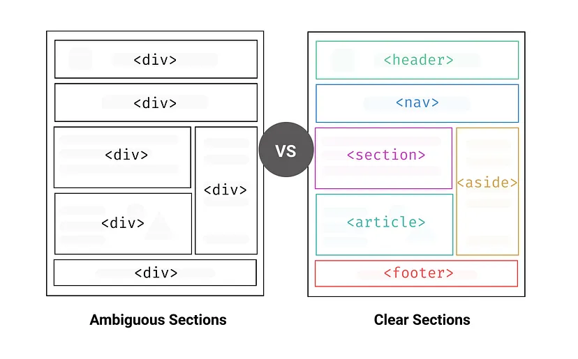

# semantic Tag

시맨틱 태그란 의미가 있는 태그를 말한다. div나 span과 같이 의미가 없는 태그는 태그 이름만 보고는 어떤 내용인지 전혀 유추할 수가 없는 반면, form, table, article 등 의미가 있는 태그는 내용을 명확하게 정의한다.

## 시맨틱 태그의 장점

1. 검색엔진최적화(SEO) : 검색엔진은 태그를 기반으로 페이지 내 검색 키워드의 우선순위를 판단한다. 따라서 제목은 h1, 중요한 단어는 strong 또는 em을 사용하는 등 의미에 맞는 올바른 태그르 사용하는 것이 중요하다.

2. 시각장애가 있는 사용자가 스크린 리더를 사용하여 페이지를 탐색할 때 도움이 된다.

3. 시맨틱 태그를 사용한 코드 블록을 찾는 것은 끝없는 div(div > div > div ...)를 탐색하는 것보다 훨씬 쉽다.

## 시맨틱 태그의 종류

1. header

- 페이지의 제목과 같은 소개 내용을 포함한다.
- 일반적으로 heading 태그나 로고 또는 아이콘, 저작권 정보, 검색 양식, 작성자 이름 등을 포함한다.

2. nav

- 보통 메뉴, 목차 등에 사용된다.

3. aside
   
- 간접적으로 문서와 관련된 내용을 나타낸다.
- 사이드바 또는 콜아웃 상자로 사용된다.

4. main
   
- 지배적인 콘텐츠 영역을 나타내는 태그이다.

5. section
   
- 구체적인 시맨틱 태그가 없는 문서의 독립적인 영역을 나타낸다
- 섹션에는 매우 소수의 예외를 제외하고 항상 제목이 있는 것이 일반적이다.

6. article
   
- 그 자체로 의미가 있는 웹사이트의 부분이며, 독립적으로 배포 또는 재사용되도록 의도 된 문서이다.
- 게시물, 잡지 또는 신문 기사, 블로그 작성글, 제품 카드, 사용자가 제출한 댓글, 대화형 위젯 등이 있다.

7. footer
   
- 일반적으로 섹션의 작성자에 대한 정보, 저작권 데이터 또는 관련 문서에 대한 링크를 포함한다.

## ➕ `<li>`요소는 왜 `<ul>`요소의 자식요소여야만 할까?

li는 목록의 항목 나타내는 요소이며 ul은 정렬되지 않은 목록이기 때문에 li는 ul의 자식요소이어야 한다.

자식요소로 사용하지 않더라도 화면상으로는 문제가 없지만 li와 ul의 의미에 맞게, 시멘틱하게 HTML을 사용하는 것이 옳다.

li는 추가로 ul외에 `menu`, `ol`의 자식요소로도 시멘틱하게 사용가능하다.

## 🌐reference

https://medium.com/codex/what-is-semantic-markup-and-why-you-should-use-it-44777543c29c

https://velog.io/@syoung125/시맨틱-태그-Semantic-Tag-잘-사용하기

https://developer.mozilla.org/en-US/docs/Web/HTML/Element