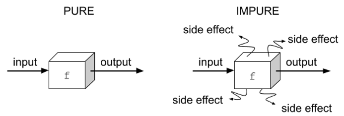

# 순수함수와 비순수함수

부수효과(Side Effect)가 없다면 순수함수(Pure Function)라고 한다. 부수효과가 있다면, 비순수함수 혹은 불순함수(Impure Function)이라고 한다.

[](https://livebook.manning.com/book/get-programming-with-scala/chapter-21/v-9/38)

## 부수 효과(Side Effect)

함수의 목적과 다른 효과 또는 부작용을 부수효과라고 한다. 부작용을 통해서 예측할 수 없는 경우가 생길 가능성이 있다면 불순함수라고 할 수 있다.

```js
// http 요청을 보내는 함수 : 순수함수 될 수 없음
const getData = () => {
  axios.get('http://data.url')
  .then(...)
  .catch(...)
}
​
// 입력 내포한 함수 : 순수함수 될 수 없음
const typeInput = () => {
const input = prompt("Message");
  return input;
}
​
// 파라미터를 직접 변경하는 함수 : 순수함수 될 수 없음
const changeParams = (arr, elem) => {
  arr.push(elem);
  return arr;
}
```

1. 동기 요청을 보내는 함수는 요청이 실패할 가능성이 있다. 
2. 입력을 포함하는 함수도 입력에 따라 출력이 달라질 가능성이 있기 때문에 순수함수가 될 수 없다. 
3. 매개변수를 직접 변경한다면 순수함수가 될 수 없다.

## 매개변수의 불변

매개변수에 대한 조작을 피하는 이유는 매개변수가 어디서 어떻게 쓰일 지 모르기 때문에 예상가능 하도록 하기 위해서이다.

```js
const num_arr = [1, 2, 3, 4, 5];

// 매개변수의 값을 직접 변경하는 불순함수
const addSixImpure = (arr) => {
  // 매개변수에 직접 6 추가
  arr.push(6);
  return arr;
};
​
// 매개변수를 복사한 값을 변경하는 순수함수
const addSixPure = (arr) => {
  // 펼침 연산자로 새로운 배열에 6 추가
  newArr = [...arr, 6];
  return newArr;
};
```

위 코드에서 매개변수로 받은 배열 객체에 직접 6을 추가한 `addSixImpure` 함수는 불순함수이며, `addSixPure`함수는 매개변수를 조작하지 않았기 때문에 순수함수이다.

불순함수가 많아지면 많아질 수록 부수효과도 많아지면서 코드를 예측하기 어렵게 될 수도 있다.

반면에 순수함수가 많아지면 많아질 수록 코드를 예측하기 쉬워진다.

## 사용 예

- react의 state
- redux의 reducer

## 🌐reference

https://maxkim-j.github.io/posts/js-pure-function/

