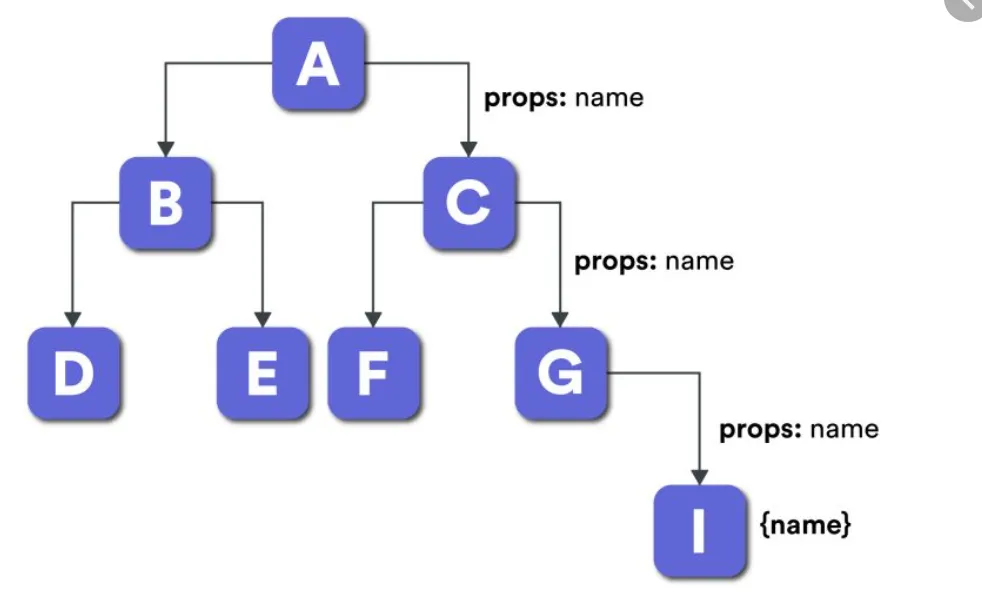

# Redux

대표적인 Javascript 상태관리 라이브러리이다.

## 상태란?

프론트엔드에 동적으로 표현되는 데이터로 즉, **변하는 데이터**다. 예로 쇼핑몰에 장바구니를 생각해보면 상품 수량, 주문할 상품 선택에 따라 변경되는 결제 금액 등이 상태다.

데이터에 대한 제어, 소유 여부에 따라서 server state와 client state로 구분할 수 있다.

### server state

서버로 부터 불러오는 데이터를 말한다. 클라이언트가 제어, 소유할 수 없기 때문에 서버로 부터 특정 시점의 데이터를 가져와 저장하여 사용한다. 때문에 비동기적인 상태를 갖는다.

### client state

언어, ui 테마, 폼 입력, 사이드바 상태 등과 같이 클라이언트가 제어, 소유하는 데이터를 말한다. 때문에 동기적인 상태를 갖는다. client state는 다시 두 가지로 구분할 수 있다.

**local client state**

폼 입력, 사이드바 상태 등과 같이 하나 또는 인접한 컴포넌트들에서 이용되는 state이다.

**global client state**

언어, ui 테마 등과 같이 어플리케이션의 여러 곳에서 사용되는 state이다.

## 전역상태관리가 필요한 이유

기본적으로 리액트에서는 상위에서 하위로 상태값을 전달하여 상태를 관리하게 되어있다.

그러나 코드가 늘어나고 그에 따라 컴포넌트가 분리되어 점점 더 많아지는 컴포넌트에서 상태를 관리하기 위해서는 결국 props를 사용하여 계속 하위 컴포넌트로 값을 전달해줘야하는 상황이 발생하게 될 것이다.

이 과정에서 일부 컴포넌트는 하위 컴포넌트에 props를 전달해주기 위해 불필요한 props를 전달받아야 하는 상황인 Prop Drilling이라는 문제가 발생하게 된다

### Props Drilling이란?

Prop Drilling은 props를 오로지 하위 컴포넌트로 전달하는 용도로만 쓰이는 컴포넌트들을 거치면서 React Component 트리의 한 부분에서 다른 부분으로 데이터를 전달하는 과정을 말한다. 

Prop Drilling은 prop전달이 3~5개 정도의 컴포넌트라면 문제가 되지 않는다. 하지만 prop 전달이 10개, 15개 그 이상으로 더 많은 과정을 거치게 된다면 코드를 읽을 때 해당 prop을 추적하기 힘들어진다. 결국 이로 인해 유지보수도 더욱 어려워지게 된다.

## 기본 원칙

**1. Single source of truth** 신뢰할 수 있는 단일 출처

*동일한 데이터는 항상 같은 곳에서 데이터를 가지고 온다*
   
- 동일한 데이터는 항상 같은 곳에서 가지고 온다.
- 즉, 스토어라는 하나뿐인 데이터 공간이 있다는 의미이다.
- 이는 데이터의 무결성을 위함이다.

> 데이터 무결성이란?
>
>데이터의 정확성을 보장하기 위해 데이터의 변경이나 수정 시 제한을 두어 안정성을 저해하는 요소를 막고 데이터 상태들을 항상 옳게 유지하는 것

**2. State is read-only** 

*상태값은 불변 객체이다.*
   
- 리액트에서는 setState 메소드를 활용해야만 상태 변경이 가능하다.
- 리덕스에서도 액션이라는 객체를 통해서만 상태를 변경할 수 있다.

**3. Changes are made with pure functions**

*상태값은 순수 함수에 의해서만 변경되어야 한다.*
   
- 변경은 순수함수로만 가능하다.
- 리듀서와 연관되는 개념이다.
- Store(스토어) – Action(액션) – Reducer(리듀서)

## redux의 구성요소

### Store (스토어)

- Store(스토어)는 상태가 관리되는 오직 하나의 공간이다.
- 컴포넌트와는 별개로 스토어라는 공간이 있어서 그 스토어 안에 앱에서 필요한 상태를 담는다.
- 컴포넌트에서 상태 정보가 필요할 때 스토어에 접근한다.

### Action (액션)

- Action(액션)은 앱에서 스토어에 운반할 데이터를 말한다. (주문서)
- Action(액션)은 자바스크립트 객체 형식으로 되어있다.

### Reducer (리듀서)

- Action(액션)을 Store(스토어)에 바로 전달하는 것이 아니다.
- Action(액션)을 Reducer(리듀서)에 전달해야한다.
- Reducer(리듀서)가 주문을 보고 Store(스토어)의 상태를 업데이트하는 것이다.
- Action(액션)을 Reducer(리듀서)에 전달하기 위해서는 dispatch() 메소드를 사용해야한다.

## 🌐reference

https://jbee.io/react/thinking-about-global-state/

https://www.kenrhee.com/blog/react-application-state-management

https://hanamon.kr/redux란-리덕스-상태-관리-라이브러리/