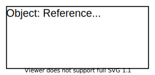

# useRef

useRef는 렌더에 필요하지 않은 값을 참조할 수 있는 React Hook이다.

```js
import { useRef } from 'react';

function MyComponent() {
  const initialValue = 0;
  const reference = useRef(initialValue);

  const someHandler = () => {
    // Access reference value:
    const value = reference.current;
    // Update reference value:
    reference.current = newValue;
  };
  // ...
}
```

`useRef(initialValue)`는 초기값으로 한개의 인자를 받으며 `ref`를 return하는 built-in 리액트 훅이다.

`reference.current`를 통해서 참조값에 접근하고 업데이트할 수 있다.



## 🛠 사용처

1. 값 참조하기
2. DOM 요소에 접근하기

### 값 참조하기

ref의 값은 변해도 리렌더링이 발생하지 않으며 렌더링이 되어도 참조되어 있는 값은 유지되는 특성이 있다.

대표적으로 호출 스케줄링 함수와 socket id를 관리해야하는 경우가 있다.

호출 스케줄링의 경우 다음 stopwatch 코드를 예로 설명해보자.

```js
import { useRef, useState, useEffect } from 'react';

function Stopwatch() {
  const timerIdRef = useRef(0);
  const [count, setCount] = useState(0);

  const startHandler = () => {
    if (timerIdRef.current) { return; }
    timerIdRef.current = setInterval(() => setCount(c => c+1), 1000);
  };

  const stopHandler = () => {
    clearInterval(timerIdRef.current);
    timerIdRef.current = 0;
  };

  useEffect(() => {
    return () => clearInterval(timerIdRef.current);
  }, []);

  return (
    <div>
      <div>Timer: {count}s</div>
      <div>
        <button onClick={startHandler}>Start</button>
        <button onClick={stopHandler}>Stop</button>
      </div>
    </div>
  );
}
```

`startHandler()` function은 start 버튼이 눌려지면 작동하는데 timer를 시작하고 timer의 id를 `timerIdRef.current = setInterval(...)`으로 참조한다.

스탑워치를 멈추기 위해서 stop 버튼을 클릭하면, `stopHandler`가 참조값을 통해 timer id에 접근한 뒤 `clearInterval(timerIdRef.current)`를 통해서 멈출 수 있다.

추가로, 컴포넌트가 unmount되는 경우 스탑워치의 스케줄링되어 있던 것을 취소해줄 필요가 있는데 useEffect의 cleanup을 통해서 스탑워치를 멈춰주면 된다.

### DOM 요소에 접근하기

react는 virtual DOM으로 관리되지만 DOM 요소에 직접적으로 접근해야할 때가 있다.

input을 focus해야하는 경우를 예로 들면,

```js
import { useRef, useEffect } from 'react';

function InputFocus() {
  const inputRef = useRef();

  useEffect(() => {
    inputRef.current.focus();
  }, []);

  return (
    <input 
      ref={inputRef} 
      type="text" 
    />
  );
}
```

useRef를 사용해서 DOM에 접근하여 input의 참조를 생성한 뒤 `element.focus()`를 이용해서 html 요소에 focus할 수 있다.

## ref의 재생성

```js
function Video() {
  const playerRef = useRef(new VideoPlayer());
  // ...
```

`new videoPlayer`를 최초 렌더링에서만 사용하는데도 불구하고 매 렌더링마다 호출한다.

이것을 해결하기 위해서는 ref를 다음과 같이 초기화해주면 된다.

```js
function Video() {
  const playerRef = useRef(null);
  if (playerRef.current === null) {
    playerRef.current = new VideoPlayer();
  }
  // ...
```

## 🌐reference

https://dmitripavlutin.com/react-useref-guide/

https://beta.reactjs.org/reference/react/useRef